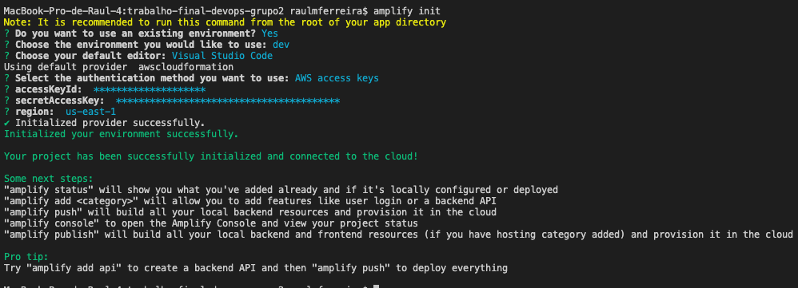

# How to - Execução e deploy do app

> Pré-requisitos: 
> - Git instalado
> - Npm instalado

1 - Fazer o clone da aplicação do repositório GIT:
```bash
    git clone https://github.com/raulsistemasj/trabalho-final-devops-grupo2.git 
```
2 - Entrar na pasta do projeto pelo terminal:
```bash
    cd trabalho-final-devops-grupo2
```
3 - Instalar o CLI do amplify:
```bash
    npm install -g @aws-amplify/cli
```
4 - Vamos configurar o acesso ao Amplify existente do projeto na AWS:
  Execute o comando - amplify init no terminal 
  Siga os passos escolhendo os paramtros conforme a imagem abaixo:
  

  OBs - o accessKeyId e secretAccessKey estão no txt enviado pelo portal fiap ao professor. 


5 - Baixar as dependências  projeto:
```bash
    npm install
```

6 - Subir a aplicação local:
```bash
    npm start
```
   


### Integrantes do trabalho:

- RM 340931 - Julio Henrique Bitencourt 
- RM 341155 - Marcos Vinicius Amaral Apóstolo
- RM 341282 - Raul Marciano Ferreira
